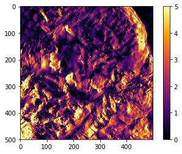
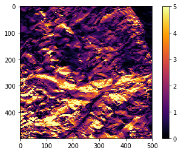
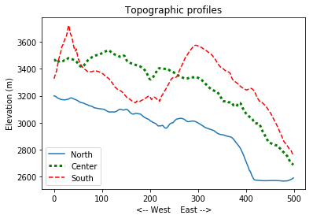
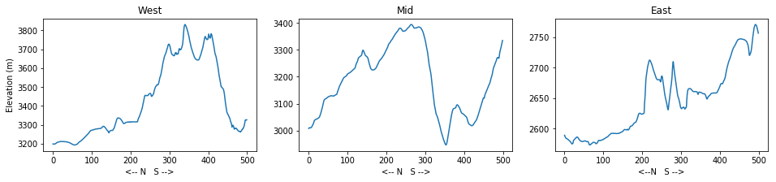

> ## Learning Objectives {.objectives}
>
> *   Perform operations on data arrays
> *   Use numpy functions and methods to calculate array statistics
> *   Create and customize simple graphs

In the previous lesson, we discussed how to import elevation data into Numpy arrays and how access and visualize that data.

If you are working in a new Jupyter Notebook, you'll need to import the Numpy library and use it to load the data file:

~~~ {.python}
import numpy
topo = numpy.loadtxt('data/topo.asc')
~~~
 

We can perform basic mathematical operations on the individual values of a Numpy array to create new arrays:

~~~ {.python}
topo_in_feet = topo * 3.2808
print 'Elevation in meters:', topo[0,0]
print 'Elevation in feet:', topo_in_feet[0,0]
~~~
~~~ {.output}
Elevation in meters: 3198.8391
Elevation in feet: 10494.7513193
~~~
 

Arrays of the same size can be used together in arithmatic operations:

~~~ {.python}
double_topo = topo + topo
print 'Double topo:', double_topo[0,0], 'meters'
~~~
~~~ {.output}
Double topo: 6397.6782 meters
~~~
 

We can also perform statistical operations on arrays:

~~~ {.python}
print 'Mean elevation:', numpy.mean(topo), 'meters'
print 'Highest elevation:', numpy.max(topo), 'meters'
print 'Lowest elevation:', numpy.min(topo), 'meters' 
~~~
~~~ {.output}
Mean elevation: 3153.62166407 meters
Highest elevation: 3831.2617 meters
Lowest elevation: 2565.0293 meters
~~~
 

The commands `numpy.mean()`, `numpy.mean()`, and `numpy.min()` call **functions** of the library *numpy* that act on the numpy array *topo*. A subset of numpy functions have an equivalent **method** - a function belonging to the numpy array. You might find examples of code using either of them:

~~~ {.python}
print 'Mean elevation:', topo.mean(), 'meters'
print 'Highest elevation:', topo.max(), 'meters'
print 'Lowest elevation:', topo.min(), 'meters' 
~~~
~~~ {.output}
Mean elevation: 3153.62166407 meters
Highest elevation: 3831.2617 meters
Lowest elevation: 2565.0293 meters
~~~
 

>## Not all functions have input  {.callout}
>
>Generally, a function receives inputs to produce outputs. However, some functions produce outputs without needing any input. For example, checking the current time doesn’t require any input:
>
>
>~~~ {.python}
>import time
>print time.ctime()
>~~~
>~~~ {.output}
>Thu May 18 23:14:06 2017
>~~~
>
>Even functions that don’t take input need parentheses.
 

>## Methods and attributes  {.callout}
>
>`mean` is a *method* of the numpy array `topo`, i.e., it is a something that the object `topo` can do just because it is a numpy array. Methods, like functions, require parentheses.
>
>A numpy array like `topo` also has *attributes* like `shape`. Attributes are not functions so they don't need parentheses.
>
>Python will *kindly* tell us if we mix this up:
>
>
>~~~ {.python}
>print topo.mean
>print topo.shape()
>~~~
>~~~ {.output}
><built-in method mean of numpy.ndarray object at 0x10fa1f4e0>
>
>---------------------------------------------------------------------------
>
>TypeError                                 Traceback (most recent call last)
>
><ipython-input-13-d66962518ca4> in <module>()
>      1 print topo.mean
>----> 2 print topo.shape()
>
>TypeError: 'tuple' object is not callable
>~~~

We can use numpy functions or methods on slices of an array:

~~~ {.python}
half_len = int(len(topo) / 2)

print 'Highest elevation of NW quarter:', topo[:half_len,
:half_len].max(), 'meters'

print 'Highest elevation of SE quarter:', topo[half_len:,
half_len:].max(), 'meters' 
~~~
~~~ {.output}
Highest elevation of NW quarter: 3600.709 meters
Highest elevation of SE quarter: 3575.3262 meters
~~~
 

Functions and methods can also be used along individual axes (rows or columns) of an array. If we want to see how the mean elevation changes with longitude (E-W), we can use the method along axis=0:

~~~ {.python}
print topo.mean(axis=0) # this is the same as numpy.mean(topo, axis=0)
~~~
~~~ {.output}
[ 3428.2054708  3427.6972338  3427.2261988  3426.584768   3426.0234734
  3425.8775458  3425.8402916  3425.8877396  3426.0181264  3426.367201
  ...
  2673.2222786  2670.2175292  2667.2640282  2664.4045236  2661.4727784
  2658.2491352  2654.994714   2651.9884342  2649.4527134  2647.065285 ]
~~~
 

To see how the mean elevation changes with latitude (N-S), we can use axis=1:

~~~ {.python}
print numpy.mean(topo, axis=1) # this is the same as topo.mean(axis=1)
~~~
~~~ {.output}
[ 2942.8326116  2943.959394   2945.045799   2945.9719808  2946.8093426
  2947.596404   2948.420486   2949.274708   2949.997857   2950.5324138
  ...
  3274.9299236  3276.043744   3277.5482738  3279.666109   3282.5904884
  3285.8577394  3289.345506   3293.4776206  3298.0340262  3302.6172956]
~~~
 

>## Stacking arrays  {.challenge}
>
>Arrays can be concatenated and stacked on top of one another using Numpy’s `vstack` and `hstack` functions (ex. `numpy.hstack([array1, array2])`).
>
>- Given the array `A`, create an array `B` that is the same height and twice the width of `A`.
>
>
>~~~ {.python}
>A = numpy.array([[1,2,3],
>                 [4,5,6],
>                 [7,8,9]])
>~~~
>
>{.solution}
>
>
>~~~ {.python}
>B = numpy.hstack([A,A])
>print A.shape, B.shape
>~~~
>~~~ {.output}
>(3, 3) (3, 6)
>~~~
>
>- Given the array `A`, create an array `C` that is the twice the height and the same width of `A`.
>{.solution}
>
>
>~~~ {.python}
>C = numpy.vstack([A,A])
>print A.shape, C.shape
>~~~
>~~~ {.output}
>(3, 3) (6, 3)
>~~~

>## Slopes  {.challenge}
>
>The gradient of the surface is an important parameter in many landscape evolution models. The function **`np.diff()`** takes a Numpy array and returns the difference between adjacent elements along a specified axis. By default, this function acts along rows.
>
>- Use `np.diff()` to calculate the elevation gradient in x and y (Hint: remember that the resolution of the elevation dataset is 2 meters).
>
>{.solution}
>
>
>~~~ {.python}
>grid_resolution = 2 # meters
>
>dzdx = np.diff(topo) / grid_resolution
>dzdy = np.diff(topo, axis=0) / grid_resolution
>~~~
>
>- If the shape of an array is (60, 40) (60 rows and 40 columns), what would the shape of the array produced by the function `np.diff()` and why?
>
>{.solution}
>
>The default output of `np.diff()` for a (60, 40) array would be size (60, 39)
>
>The function `np.diff()` will output an array that is one cell shorter in the axis along which the difference is calculated.
>
>- What are the highest and lowest values of slope in the array `topo`?
>
>Hint: Use `np.abs()` to get the absolute values of entries in an array. You can get the maximum of two values with `np.max([value1, value2])`.
>
>{.solution}
>
>
>~~~ {.python}
>abs_dzdx = np.abs(dzdx)
>abs_dzdy = np.abs(dzdy)
>
>print 'Max slope:', np.max([np.max(abs_dzdx), np.max(abs_dzdy)])
>print 'Min slope:', np.min([np.min(abs_dzdx), np.min(abs_dzdy)])
>~~~
>~~~ {.output}
>Max slope: 26.09635
>Min slope: 0.0
>~~~

>## Plotting slopes (Advanced)  {.challenge}
>
>Make figures showing the two arrays of the absolute magnitude of surface gradient using the `matplotlib.pyplot` function `imshow`. Remember to import the correct libraries and use the iPython magic function! (Hint: look at the previous lesson for an example).
>
>- Change the colormap with the argument `cmap`. Look at the available colormaps here: [http://matplotlib.org/users/colormaps.html](http://matplotlib.org/users/colormaps.html)
>- Add a colorbar with the function `matplotlib.pyplot.colorbar()`.
>- Set the color range with the arguments `vmin` and `vmax`. Use the range 0 to 5.
>
>{.solution}
>
>
>~~~ {.python}
>import matplotlib.pyplot
>%matplotlib inline
>
>matplotlib.pyplot.imshow(abs_dzdx, vmin=0, vmax=5, cmap='inferno')
>matplotlib.pyplot.colorbar()
>~~~
>
>
>
>~~~ {.python}
>matplotlib.pyplot.imshow(abs_dzdy, vmin=0, vmax=5, cmap='inferno')
>matplotlib.pyplot.colorbar()
>~~~
>

## Plotting, take 2

It’s hard to get a sense of how the topography changes across the landscape from big tables of numbers. A simpler way to display this information is with line plots.

We are again going to use the *matplotlib* package for data visualization. If you are using the same Notebook that you used for the previous lesson, the *matplotlib.pyplot* library is still available. As a review, though, we are going to write every step that's needed to load and plot the data.

We use the function `plot` to create a basic line plot of elevation across the array:

~~~ {.python}
import numpy as np
import matplotlib.pyplot as plt
%matplotlib inline

topo = np.loadtxt('data/topo.asc')

plt.plot(topo[0,:]) # the first row
~~~

~~~ {.python}
plt.plot(topo[-1,:], 'r--') # the last row
~~~

 

>## Scientists dislike typing  {.callout}
>
>We will always use the syntax `import numpy` to import the library Numpy. However, in order to save typing and minimize errors, it is often suggested to make a shortcut like so: `import numpy as np`.
>
>It doesn't matter what you use as a shortcut, but it's common to use *np* for Numpy and *plt* for matplotlib.pyplot. If you ever see Python code using a Numpy function with np (for example, `np.loadtxt(...)`), it’s because they’ve used this shortcut.

It's difficult to compare profiles on separate plots. Let's plot three separate profiles in the same figues.
 

In a Python script, all plots will be stored in the memory buffer for one figure until the function `plt.show()` is called. The function `plt.show()` empties that buffer and creates one figure with the output of all plotting functions.

The function `plt.savefig()` can be used to save the figure to a file. You need to save the figure *before* calling `plt.show()`!

You can add the argument `label` to `plt.plot()` to set the text that will appear in the legend.

~~~ {.python}
import numpy as np
import matplotlib.pyplot as plt
%matplotlib inline

topo = np.loadtxt('data/topo.asc')

plt.plot(topo[0,:], label='North')
plt.plot(topo[len(topo)/2,:], 'g:', linewidth=3, label='Center')
plt.plot(topo[-1,:], 'r--', label='South')

plt.title('Topographic profiles')
plt.ylabel('Elevation (m)')
plt.xlabel('<-- West    East -->')
plt.legend(loc = 'lower left')

plt.savefig('topo_profiles.png', dpi = 300)
plt.show() 
~~~

 

>## Changes with latitude {.challenge}
>
>- Create one figure showing how the maximum (`np.max()`), minimum (`np.min()`), and mean (`np.mean()`) elevation changes with latitude (North - South). Label the axes and include a title for the plot (Hint: use axis=1). Create a legend.
>
>{.solution}
>
>
>~~~ {.python}
>plt.plot(np.max(topo, axis=1), label='Max')
>plt.plot(np.mean(topo, axis=1), label='Mean')
>plt.plot(np.min(topo, axis=1), label='Min')
>
>plt.title('Topographic profiles')
>plt.ylabel('Elevation (m)')
>plt.xlabel('<-- North    South -->')
>plt.legend(loc = 'upper left')
>
>plt.show() 
>~~~

 

>## Subplots  {.challenge}
>
>The script below uses **subplots** to create a figure of elevation profiles at the western edge, the center and the eastern edge of the region. Subplots can be a little tricky because they require the axes to be defined before plotting. Type (don’t copy-paste!) the code below to get a sense for how it works.
>
>This script uses a number of new commands:
>
>- The function `plt.figure()` creates a space into which we will place the three plots.
>- The argument `figsize` tells Python how big to make this space.
>- Each subplot is placed into the figure using the `subplot` command. The subplot command takes 3 parameters: the total number of rows of subplots in the figure, the total number of columns of subplots in the figure, and the final parameters identifies the position of the subplot in the grid.
>- The axes of the subplots are assigned to variable names (here, ax1, ax2, ax3, ax4).
>- Once a subplot is created, its axes can be labeled using the `set_xlabel()` and `set_ylabel()` methods.
>
>
>~~~ {.python}
>import numpy as np
>import matplotlib.pyplot as plt
>%matplotlib inline
>
>topo = np.loadtxt('data/topo.asc')
>
>fig = plt.figure(figsize=(16.0, 3.0))
>
>ax1 = fig.add_subplot(1,3,1)
>ax2 = fig.add_subplot(1,3,2)
>ax3 = fig.add_subplot(1,3,3)
>
>ax1.plot(topo[:,0])
>ax1.set_ylabel('Elevation (m)')
>ax1.set_xlabel('<-- N   S -->')
>ax1.set_title('West')
>
>ax2.plot(topo[:,len(topo)/2])
>ax2.set_xlabel('<-- N   S -->')
>ax2.set_title('Mid')
>
>ax3.plot(topo[:,-1])
>ax3.set_xlabel('<--N   S -->')
>ax3.set_title('East')
>
>plt.show() 
>~~~
>{.solution}
>
 

>## Customize the subplots  {.challenge}
>
>- The y axes of the three subplots have different ranges. This makes it hard to compare the elevation profiles. Use the method `set_ylim(min_val, max_val)` on each of each subplot axes to set the y range.
>
>- Refactor (modify, improve) your subplot script to automatically set a more appropriate range for the y axis instead of setting the minimum and maximum values by hand
>
>Hint: you can use the numpy functions `np.min()` and `np.max()`) to do this.
>
>{.solution}
>
>
>~~~ {.python}
>import numpy as np
>import matplotlib.pyplot as plt
>%matplotlib inline
>
>topo = np.loadtxt('data/topo.asc')
>
>fig = plt.figure(figsize=(16.0, 3.0))
>
>ax1 = fig.add_subplot(1,3,1)
>ax2 = fig.add_subplot(1,3,2)
>ax3 = fig.add_subplot(1,3,3)
>
>max_elev = np.max(topo) + 100 # adds some padding around the profiles
>min_elev = np.min(topo) - 100
>
>ax1.plot(topo[:,0])
>ax1.set_ylim(min_elev, max_elev)
>ax1.set_ylabel('Elevation (m)')
>ax1.set_xlabel('<-- N   S -->')
>ax1.set_title('West')
>
>ax2.plot(topo[:,len(topo)/2])
>ax2.set_ylim(min_elev, max_elev)
>ax2.set_xlabel('<-- N   S -->')
>ax2.set_title('Center')
>
>ax3.plot(topo[:,-1])
>ax3.set_ylim(min_elev, max_elev)
>ax3.set_xlabel('<--N   S -->')
>ax3.set_title('East')
>
>plt.show() 
>~~~
>
 

>## Re-arrange subplots  {.challenge}
>
>- Modify the subplot script to display the three plots on top of one another instead of side by side.
>
>- Change the figure size, titles and axis labels to fit the new layout.
>
>- Use different line style for each of the three plots and set their label attributes. Create a legend for each of the axes (ex. `ax3.legend()`).
>
>{.solution}
>
>
>~~~ {.python}
>import numpy as np
>import matplotlib.pyplot as plt
>%matplotlib inline
>
>topo = np.loadtxt('data/topo.asc')
>
>fig = plt.figure(figsize=(5.0, 10.0))
>
>ax1 = fig.add_subplot(3,1,1)
>ax2 = fig.add_subplot(3,1,2)
>ax3 = fig.add_subplot(3,1,3)
>
>max_elev = np.max(topo) + 100 # adds some padding around the profiles
>min_elev = np.min(topo) - 100
>
>ax1.plot(topo[:,0], label='West')
>ax1.set_ylim(min_elev, max_elev)
>ax1.legend(loc = 'upper left')
>
>ax2.plot(topo[:,len(topo)/2], 'm:',label='Center')
>ax2.set_ylim(min_elev, max_elev)
>ax2.set_ylabel('Elevation (m)')
>ax2.legend(loc = 'upper left')
>
>ax3.plot(topo[:,-1], 'g-.', label='East')
>ax3.set_ylim(min_elev, max_elev)
>ax3.set_xlabel('<--N   S -->')
>ax3.legend(loc = 'upper left')
>
>plt.show() 
>~~~
>
 

>## Displaying quadrants  {.challenge}
>
>Make a 2x2 grid of subplots that use `imshow` to display each quarter of the `topo` array. Make sure that the four quarters are in the correct positions. Don’t worry about adding axis labels or a colorbar.
>
>You can set the color range for `imshow` with the arguments `vmin` and `vmax`:
>
>`plt.imshow(topo, vmin = min_value, vmax = max_value)`
>
>{.solution}
>
>
>~~~ {.python}
>import numpy as np
>import matplotlib.pyplot as plt
>%matplotlib inline
>
>topo = np.loadtxt('data/topo.asc')
>
>fig = plt.figure(figsize=(10.0, 10.0))
>
>min_elev = topo.min()
>max_elev = topo.max()
>
>ax1 = fig.add_subplot(2,2,1)
>ax2 = fig.add_subplot(2,2,2)
>ax3 = fig.add_subplot(2,2,3)
>ax4 = fig.add_subplot(2,2,4)
>
>ax1.imshow(topo[:len(topo)/2, :len(topo)/2], vmin=min_elev, vmax=max_elev)
>ax2.imshow(topo[:len(topo)/2, len(topo)/2:], vmin=min_elev, vmax=max_elev)
>ax3.imshow(topo[len(topo)/2:, :len(topo)/2], vmin=min_elev, vmax=max_elev)
>ax4.imshow(topo[len(topo)/2:, len(topo)/2:], vmin=min_elev, vmax=max_elev)
>
>plt.show()
>~~~
>
